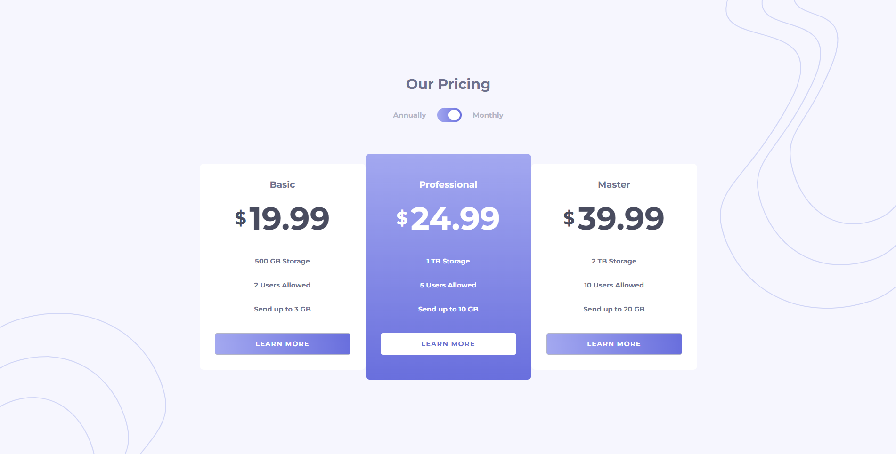

# Frontend Mentor - Pricing component with toggle solution

This is a solution to the [Pricing component with toggle challenge on Frontend Mentor](https://www.frontendmentor.io/challenges/pricing-component-with-toggle-8vPwRMIC). Frontend Mentor challenges help you improve your coding skills by building realistic projects. 

## Table of contents

- [Overview](#overview)
  - [The challenge](#the-challenge)
  - [Screenshot](#screenshot)
  - [Links](#links)
- [My process](#my-process)
  - [Built with](#built-with)
- [Author](#author)

## Overview

### The challenge

Users should be able to:

- View the optimal layout for the component depending on their device's screen size
- Control the toggle with both their mouse/trackpad and their keyboard

### Screenshot

### Links

- Solution URL: [Link](https://github.com/barbodGarsha/fylo-data-storage-component-master)
- Live Site URL: [Link](https://barbodgarsha.github.io/fylo-data-storage-component-master/)

## My process

### Built with

- HTML
- SCSS
- JS
- Flexbox
- [BEM](https://getbem.com)

## Author

- Frontend Mentor - [@barbodGarsha](https://www.frontendmentor.io/profile/barbodGarsha)
